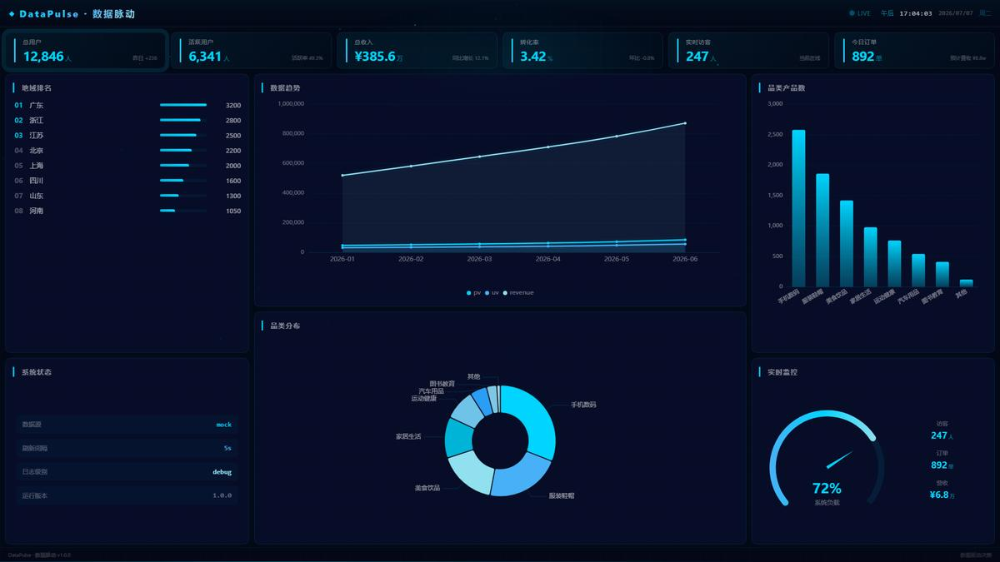

# DataPulse · 数据脉动

> 🚀 **从 0 到 1 构建企业级数据大屏 —— React 教学项目**

<p align="center">
  
</p>

<p align="center">
  <b>DataPulse</b>（数据脉动）是一个面向高校学生的数据可视化大屏教学项目，采用 React + Vite + ECharts 技术栈。
</p>

---

## 📖 目录

- [技术栈](#技术栈)
- [快速开始](#快速开始)
- [项目结构](#项目结构)
- [功能概览](#功能概览)
- [设计体系](#设计体系)
- [课程路线图](#课程路线图)
- [贡献指南](#贡献指南)

---

## 🧰 技术栈

| 技术 | 用途 | 版本 |
|:----|:-----|:----:|
| **React** | UI 框架 | 19.x |
| **Vite** | 构建工具 | 8.x |
| **Zustand** | 状态管理 | 5.x |
| **ECharts** | 数据可视化 | 6.x |
| **Tailwind CSS** | 样式方案 | 4.x |
| **Vitest** | 单元测试 | 4.x |
| **Axios** | HTTP 客户端 | 1.x |

---

## ⚡ 快速开始

```bash
# 1. 安装依赖
npm install

# 2. 启动开发服务器
npm run dev

# 3. 构建生产版本
npm run build

# 4. 运行测试
npm run test:run
```

---

## 📁 项目结构

```
DataPulse/
├── src/
│   ├── main.jsx                  # 入口
│   ├── App.jsx                   # 根组件
│   ├── config/                   # 应用配置
│   ├── hooks/                    # 自定义 Hooks
│   │   ├── useData.js            # 数据获取
│   │   ├── useECharts.js         # ECharts 实例管理
│   │   └── useRealtime.js        # 实时数据
│   ├── store/                    # Zustand 状态
│   ├── services/                 # 数据服务层
│   │   ├── dataSource.js         # 数据源工厂
│   │   ├── adapters/             # Mock/API 适配器
│   │   └── mock/                 # Mock 数据
│   ├── logger/                   # 日志系统
│   ├── charts/                   # 图表组件
│   │   ├── BarChart.jsx
│   │   ├── LineChart.jsx
│   │   ├── PieChart.jsx
│   │   ├── GaugeChart.jsx
│   │   └── core/ChartBase.jsx
│   ├── components/               # UI 组件
│   │   ├── layout/               # Header/Footer/Layout
│   │   ├── common/               # Card/Loading/ErrorBoundary
│   │   └── data-display/         # KpiCard/RankList/TopKpiBar
│   └── pages/
│       └── Dashboard/            # 大屏主页
├── tests/                        # 测试
└── docs/                         # 文档
```

---

## 🎯 功能概览

### 布局方案

```
┌──────────────────────────────────────────────────────────────┐
│                    Top KPI Bar (6 项指标)                     │
│  总用户 · 活跃用户 · 总收入 · 转化率 · 实时访客 · 今日订单   │
├───────────┬─────────────────────────┬────────────────────────┤
│  左栏      │       中栏              │       右栏             │
│  地域排名  │    📈 数据趋势 (Line)    │    📊 品类数 (Bar)     │
│  系统状态  │    🥧 品类分布 (Pie)    │    🎯 实时监控 (Gauge)  │
└───────────┴─────────────────────────┴────────────────────────┘
```

### 核心特性

| 特性 | 说明 |
|:----|:------|
| 📊 **数据可视化** | 折线图 / 柱状图 / 饼图 / 仪表盘，ECharts 封装 |
| 🎨 **蓝冰科技主题** | 深蓝背景 + 亮青高亮 + 冰蓝渐变 |
| 🧩 **模块化架构** | 组件/Hooks/Service 分层解耦 |
| 📋 **日志系统** | 分级日志收集，调试面板 |
| 🧪 **测试覆盖** | Vitest + Testing Library，12+ 用例 |
| 🌊 **动态氛围** | Canvas 粒子背景 + 流光线条 + 入场动效 |

---

## 🎨 设计体系

### 色彩

| Token | 色值 | 用途 |
|:------|:----:|:-----|
| `--bg-deepest` | `#040816` | 最深背景 |
| `--bg-deep` | `#080d26` | 主背景 |
| `--color-primary` | `#00d4ff` | 亮青主色 |
| `--color-accent` | `#00b4d8` | 湖蓝辅助 |
| `--color-light` | `#90e0ef` | 冰蓝柔和色 |

### 动效

- **粒子背景**: 60 粒子漂浮，鼠标靠近散开，近距离连线
- **流光线条**: 页面顶部/底部流光线，3-4s 循环
- **图表入场**: 弹性弹出 / 平滑划入 / 旋转展开
- **KPI 波纹**: 首个指标卡片带 ripple 扩散动画

### 架构决策

项目采用 **组件化 SPA + 适配器模式**：

```
组件 → useData Hook → DataSourceFactory
                          ├─ MockAdapter（开发期）
                          └─ ApiAdapter（生产期，可扩展）
```

通过环境变量 `VITE_DATA_SOURCE=mock|api` 一键切换数据源。

---

## 🗺️ 课程路线图

```
阶段 1: HTML 骨架    → 理解大屏布局结构
阶段 2: CSS 布局     → Flex/Grid + 暗色主题
阶段 3: 图表集成     → ECharts 组件化封装
阶段 4: 数据对接     → 适配器模式 Mock/API
阶段 5: 实时刷新     → WebSocket / SSE（进阶）
阶段 6: 交互动效     → 粒子 / 流光 / 入场动画
阶段 7: 部署上线     → GitHub Pages / Vercel
```

---

## ✅ 验证

```bash
npm run build      # 构建 ✅
npm run test:run   # 测试 ✅（12 用例）
npm run lint       # 代码检查 ✅
```

---

## 🤝 贡献指南

```bash
git checkout -b feat/your-feature
git commit -m "feat: add ..."
git push origin feat/your-feature
```

提交规范：[Conventional Commits](https://www.conventionalcommits.org/)

---

## 📄 许可证

MIT © DataPulse Team

---

<p align="center">
  <b>DataPulse · 数据脉动</b><br/>
  <sub>从零开始，让数据跳动起来 ✦</sub>
</p>

